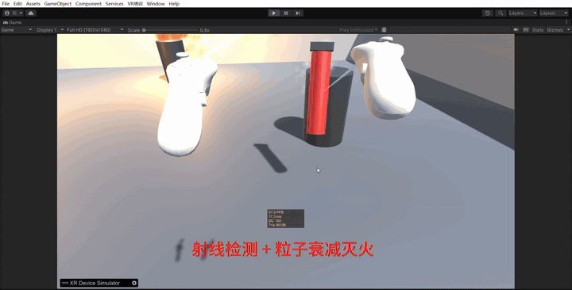

# VR 灭火器安全培训 Demo

基于 **Unity 2022.3 + XR Interaction Toolkit** 的 VR 消防培训场景。
一键程序化生成培训房间、火源、可抓取灭火器与结算 UI，支持 **XR Device Simulator 无头显调试**，
并带一套可在批处理模式下运行的自动化验证工具。

对标产品形态：政企 VR 安全培训（灭火器/叉车/应急演练）。

---

## 演示



抓取灭火器 → 瞄准火源喷射 → 火焰粒子与火光随火势衰减 → 三处火源全灭，弹出结算面板与评分。

> GIF 为 13 秒节选（完整录屏 44 秒）。录制环境：XR Device Simulator，无真头显。

---

## 技术栈

| 项 | 版本 / 说明 |
|---|---|
| Unity | 2022.3.14f1c1 (LTS) |
| 渲染 | Built-in（未用 URP） |
| XR Interaction Toolkit | 2.6.5 |
| OpenXR | 1.14.3 |
| XR Plugin Management | 4.4.0 |
| Input System | 1.8.2（`activeInputHandler = Both`） |
| XR Hands | 1.8.1 |
| 无头显方案 | XR Device Simulator（XRI 官方样例） |

> 本机**没有装 OpenXR 运行时**，所以编辑器里靠 XR Device Simulator 跑；
> Console 里的 `xrCreateInstance: XR_ERROR_RUNTIME_UNAVAILABLE` 是噪音，接真头显才需要装运行时。

---

## 快速开始

1. 用 Unity 2022.3.14f1c1 打开工程（首次打开会自动下载 XRI 等包）
2. 菜单 **VR培训 → 一键生成灭火器培训场景**
   - 会自动生成房间/火源/灭火器/UI/方向光/性能 HUD，并把 XRI 的
     `XR Interaction Setup`（= XR Origin + Interaction Manager + Input Action Manager + EventSystem）
     与 `XR Device Simulator` 预制体放进场景
   - 场景保存到 `Assets/Scenes/VRFireTraining.unity`
3. 按 Play，用下面的模拟器键位操作

### XR Device Simulator 键位

| 操作 | 按键 |
|---|---|
| 操纵右手柄 / 左手柄 | 按住 `空格` / 左 `Shift` |
| 抓取 / 放下灭火器 | `G`（**切换式**：按一次抓住，再按一次放下） |
| 喷射 | 按住**鼠标右键** |
| 转头 | 松开空格后直接移动鼠标 |
| 平移 / 升降 | `W A S D` / `Q E` |
| 切换鼠标「平移 / 旋转」模式 | `R` |
| 临时强制旋转 | 按住左 `Ctrl` |
| 锁定光标到 Game 视图 | `\` |
| 重置手柄位置 | `V` |
| 显示 / 隐藏性能 HUD | `F1` |

> 手里**抓着灭火器**时，`W A S D` / `Q E` 的语义会切换成「拿着灭火器走路」，
> 不再把手伸出去。原因见 [核心实现 6](#6-拿着灭火器走路接管模拟器位移)——
> 否则物体跟着手柄跑，透视上会忽大忽小。

---

## 代码结构

```
Assets/
├── Scripts/
│   ├── Fire.cs                        # 单个火源：火势衰减 / 复燃 / 熄灭事件
│   ├── Extinguisher.cs                # 灭火器：喷射判定 + 射线检测 + 粒子表现
│   ├── TrainingManager.cs             # 培训流程：进度统计 / 用时 / 评分 / UI 驱动
│   ├── PerformanceHUD.cs              # 运行时性能 HUD（FPS / ms / DrawCall / 三角面）
│   └── SimulatorGrabLocomotion.cs     # 无头显调试：抓住物体后 WASD 变成「拿着走」
└── Editor/
    ├── FireSceneBuilder.cs            # 一键生成完整场景（MenuItem）
    └── FireVerification.cs            # 自动化验证（MenuItem + batchmode）
```

**设计原则：数据与表现分离。**
`Fire` 只管火势数值和事件，`Extinguisher` 只管「打中谁、扣多少」，`TrainingManager` 只订阅事件做统计，
三者互不引用具体实现——加新火源不需要改任何现有代码。

---

## 核心实现

### 1. 一键生成场景（Editor 扩展）

`FireSceneBuilder.cs` 用 `MenuItem` 暴露一个菜单项，从空场景程序化构建全部内容：

- 材质：`Shader.Find("Universal Render Pipeline/Lit")`，找不到则回退 `Standard`
- 房间：`GameObject.CreatePrimitive` 生成地面 + 四面墙，地面挂 `TeleportationArea`
- 火源：火盆 + 火焰粒子 + 烟雾粒子 + 点光 + `Fire` 逻辑 + 命中体
- 灭火器：瓶身 / 把手 / 喷口 / 喷射粒子 + `Rigidbody` + `BoxCollider` + `XRGrabInteractable` + `Extinguisher`
- UI：世界空间 Canvas + 状态文本 + 完成面板
- 主光：Directional Light（软阴影）
- 性能 HUD
- 自动按文件名在所有预制体里查找并实例化 XRI 的 `XR Interaction Setup` 与 `XR Device Simulator`

> 这是 JD 里「有 U3D 开发插件经验者优先考虑」的直接对应物：
> 一个能一键产出可用场景的编辑器工具，而不是手搓场景。

### 2. 切换式抓取

默认 `XRGrabInteractable` 是「按住 Grip 才抓、松开就掉」。本项目改成**按一次抓住、再按一次放下**，
用的是 XRI 内置的触发模式而不是自定义脚本：

```
Starter Assets/Prefabs/Interactors/Ray Interactor.prefab
  m_SelectActionTrigger: 2      # InputTriggerType: State=0 / StateChange=1 / Toggle=2 / Sticky=3
```

`XRBaseControllerInteractor` 里 `Toggle` 的语义是
「按下这一帧开始交互，直到第二次按下才结束」，正好等价于切换式抓取。

### 3. 喷射与灭火

`Extinguisher.Update()`：

```
origin = nozzle.position
dir    = nozzle.forward          # 喷口的正前方
Physics.Raycast(origin, dir, out hit, range=6, hitMask, QueryTriggerInteraction.Ignore)
  → hit.collider.GetComponentInParent<Fire>()?.Extinguish(extinguishPerSecond * deltaTime)
```

`Fire` 侧：`maxHealth = 100`、`extinguishPerSecond = 45`、`regrowPerSecond = 3`（会缓慢复燃，逼玩家连续喷）。
火势归零触发 `OnExtinguished`，`TrainingManager` 订阅它做统计。

**粒子与灯光随火势联动**：`ApplyVisual()` 按 `Health01` 同步 `ParticleSystem.emission.rateOverTimeMultiplier`
和 `Light.intensity`，所以灭火过程是「火焰变小、火光变暗」而不是突然消失。

### 4. 灭火结算

`TrainingManager` 在 `Start()` 里用 `firesRoot.GetComponentsInChildren<Fire>()` 收集火源并订阅事件，
统计已扑灭数量与用时，全部扑灭后弹出完成面板并给出评分（`100 - 用时秒数`）。

### 5. 性能 HUD

`PerformanceHUD` 用**世界空间 Canvas 挂在相机前下方**，而不是 `Screen Space - Overlay`——
因为 Overlay 画布在 VR 头显里不渲染，只有世界空间画布才能同时出现在头显和 Game 视图里。

显示 FPS / 帧耗时 / DrawCall / 三角面。FPS 用指数平滑避免跳数，并按时段变色
（< 72fps 变黄、< 45fps 变红），因为 VR 的目标帧率是 72/90fps，掉帧是眩晕的首要原因。
DrawCall 与三角面通过 `ProfilerRecorder(ProfilerCategory.Render, ...)` 读取，取不到就显示 `-`。

### 6. 拿着灭火器走路（接管模拟器位移）

无头显调试时会撞上一个反直觉的问题：**手柄操纵键和移动键是同一个**。
按住空格操纵右手柄，再按 `W` 本意是「把手伸出去」，
但抓着灭火器时这一下会让物体跟着手柄往相机前方跑，透视上忽大忽小。

根因在 `XRDeviceSimulator.ProcessPoseInput()`：当 `axis2DTargets` 含 `Position` 时，
它把键盘位移**直接累加到被操纵手柄的 `devicePosition`**；
而 `XRGrabInteractable` 又把物体牢牢钉在手上，于是物体跟着一起跑。
这是模拟器的设计行为，真头显里不存在。

`SimulatorGrabLocomotion.cs` 的思路是**在模拟器之后接管这段位移**：

| 要点 | 做法 |
|---|---|
| 抢在模拟器之后 | `[DefaultExecutionOrder(10000)]` + `LateUpdate()`，改写结果不会被覆盖 |
| 什么时候介入 | 按住手柄操纵键 **且** 手里确实抓着东西（`manipulatingXxxDevice && XRGrabInteractable.isSelected`） |
| 介入后怎么动 | 不再动手柄，而是把同一段位移**同时加到 HMD 和双手柄**，三者相对位置不变 → 视觉上就是「拿着灭火器走路」 |
| 没按方向键时 | 不介入，但把基准位姿同步到当前值，避免和模拟器抢控制权 |
| 位移算法 | 与模拟器 FPS 分支一致：`keyboardXxxTranslateSpeed × keyboardBodyTranslateMultiplier × dt`，再按相机水平朝向旋转、变换回 `cameraParent` 局部空间 |

**没有 fork XRI 包，也没有往场景里拖组件**——
脚本用 `[RuntimeInitializeOnLoadMethod(AfterSceneLoad)]` 自建 GameObject 自动挂载。

---

## 自动化验证

`FireVerification.cs` 提供菜单项 **VR培训 → 验证灭火命中与熄灭**，也可以完全无界面运行：

```bash
Unity.exe -batchmode -nographics -projectPath <工程路径> \
          -executeMethod FireVerification.Verify -logFile - -quit
```

结果写入工程根目录 `verify_result.txt`，并用 `RESULT=PASS/FAIL` 标记。

### 检查项（8 项）

| # | 检查 | 说明 |
|---|---|---|
| 1 | 喷口瞄准火源命中体 | 手持姿态下射线命中正确的 `Fire` |
| 2 | 纯水平射线命中 | 验证命中体高度足够 |
| 3 | A/B 对照 | 临时禁用命中体后射线应打空，反证命中体必需 |
| 4 | 熄灭链路 | 模拟 60Hz 持续喷射 → 火势归零 + 事件只触发一次 |
| 5 | UI 面板朝向 | `dot(canvas.forward, dirToCamera)` 判断文字是否镜像 |
| 6 | 交互器触发模式 | 至少一个 `XRRayInteractor` 为 `Toggle` |
| 7 | 抓取物理配置 | `throwOnDetach = false` 且 `movementType = Instantaneous` |
| 8 | 主光与性能 HUD | 方向光与 `PerformanceHUD` 均已挂载 |

> 这套工具的价值不在「测试数量」，而在**把 VR 交互里那些肉眼难查的几何/配置问题变成可回归的断言**。
> 例如第 3 项用「禁用后必须打空」来反证修复的必要性，比单纯断言「能打中」更有说服力。

---

## 关键设计决策与踩坑记录

这些是本项目真正花时间的地方，也是最能体现工程能力的地方。

### ① 喷口朝向：四元数不是装饰

生成器最初写的是：

```csharp
nozzle.transform.localRotation = Quaternion.Euler(90f, 0f, 0f);   // 注释写着"朝前方"
```

但 `Euler(90,0,0)` 会把局部 +Z 转到 **-Y（垂直向下）**，而 `Extinguisher` 正是用 `nozzle.forward` 做射线方向——
结果是射线永远打地面，灭火器完全失效。改成 `Quaternion.identity` 后 `forward` 才是瓶身正前方。
注释和代码不一致时，**以代码为准去算一遍**。

### ② 火源命中体：瞄准可见火焰却打不中

火盆用的是 `CapsuleCollider`（radius 0.5 / height 2 / 方向 Y），配合非均匀缩放 `(0.5, 0.4, 0.5)`：

- 世界半径 = `0.5 × max(scaleX, scaleZ)` = **0.25**（Y 轴胶囊取 X/Z 里较大的那个）
- 世界高度 = `2 × 0.4` = **0.8**，即世界 y ∈ [0.0, 0.8]

而火焰粒子发射器的位置是 `local y = 0.45` → **世界 y = 0.85**，已经高过命中体顶端。
也就是说「瞄准看见的火焰」必然打空。

修复：给火源根节点补一个 `BoxCollider size(0.7, 1.6, 0.7) center(0, 0.8, 0)`，
世界 y 覆盖 **0.4 ~ 2.0**，与可见火焰高度对齐。

### ③ 世界空间 Canvas 该朝哪边

世界空间 Canvas 的 UI 是在**局部 XY 平面按 +X 方向排版**的，
要让文字正常可读，观察者必须站在画布的**局部 -Z 侧**——
因为观察者右轴 `right = Cross(up, forward)`，只有当 `forward` 朝 +Z 时，局部 +X 才落在观察者右手边。

玩家出生点在画布 -Z 侧，所以画布必须保持 `identity`；
之前写成 `Euler(0, 180, 0)` 会让可读面朝向 +Z（背对玩家），文字左右镜像。

### ④ 模拟器的扳机只写给「正在被操纵的手柄」

`XRDeviceSimulator.cs:2543-2549`：

```csharp
if (manipulatingLeftController)
    ProcessButtonControlInput(ref m_LeftControllerState);       // 真正写 grip/trigger 按钮位
else
    ProcessAnalogButtonControlInput(ref m_LeftControllerState); // 只调模拟值，不写按钮位
```

`ProcessButtonControlInput` 里才有 `controllerState.WithButton(ControllerButton.TriggerButton, ...)`。

结论：**松开空格之后，模拟手柄的扳机按钮永远按不下去**，XRI 的 `Activate` 不会触发。
所以「松开空格 → 右键喷水」这个流程在模拟器下走不通原生链路，
`Extinguisher` 里改成直接读 `Mouse.current.rightButton` 来驱动喷射（`mouseRightButtonSpray` 开关）。

### ⑤ 松手甩飞：ThrowOnDetach

`XRGrabInteractable.Detach()` 在 `m_ThrowOnDetach` 为真时会把手柄当前速度写回刚体：

```csharp
m_Rigidbody.velocity = m_DetachLinearVelocity;
m_Rigidbody.angularVelocity = m_DetachAngularVelocity;
```

模拟器里手柄跟着鼠标动，松手瞬间鼠标还在动就会把灭火器甩出去。改成 `throwOnDetach = false`。

### ⑥ 枚举顺序不能靠猜

排查过程中我一度误判 `XRBaseInteractable.MovementType` 的顺序，实际是：

```csharp
public enum MovementType { VelocityTracking = 0, Kinematic = 1, Instantaneous = 2 }
```

同理 `XRBaseControllerInteractor.InputTriggerType` 是
`State = 0, StateChange = 1, Toggle = 2, Sticky = 3`。
**场景 YAML 里存的是整数**，顺序猜错就会得出完全相反的结论——必须去源码里核对。

### ⑦ 改输入绑定不能把动作删空

XRI 的模拟器帮助面板用 `controls[0]` 索引绑定列表
（`XRDeviceSimulatorUI.cs:485` 读 `manipulateHeadAction`，`XRDeviceSimulatorControllerUI.cs:103/124` 读 `gripAction`）。
把某个动作的绑定全部删掉，`controls` 长度为 0，索引 `[0]` 直接抛
`ArgumentOutOfRangeException`。**改绑定只能改 path，不能删到零个。**

### ⑧ 反射读模拟器私有状态：为什么这次值得

`XRDeviceSimulator` 把三个设备状态存成私有字段：

```csharp
XRSimulatedControllerState m_LeftControllerState;
XRSimulatedControllerState m_RightControllerState;
XRSimulatedHMDState        m_HMDState;
```

**没有任何公开 API 能改写它们**，而 `SimulatorGrabLocomotion` 必须改写。
摆在面前三条路：fork 整个 XRI 包、直接改包源码、反射。前两条会让以后升级 XRI 变成噩梦，所以选反射：

```csharp
_fLeft = type.GetField("m_LeftControllerState",
                       BindingFlags.Instance | BindingFlags.NonPublic);
```

两个必须注意的点：

1. **它们是 `struct`**。`GetValue` 拿到的是**副本**，改副本对模拟器没有任何影响——
   必须「整块读出 → 改 → 整块 `SetValue` 写回」，不能只改其中一个字段。
2. **字段名是私有实现细节**，XRI 升级后可能改名。所以拿不到字段时
   **打一条明确的错误日志并 `enabled = false` 优雅降级**，
   而不是每帧抛 `NullReferenceException` 把 Console 刷爆。

### ⑨ 脚本创建的粒子系统，材质引用会丢

录演示视频时发现火焰是**洋红色**的——Unity 里「材质丢失」的标志色。
回头查提交的场景文件，7 个 `ParticleSystemRenderer` 的材质全是空：

```yaml
ParticleSystemRenderer:
  m_Materials:
  - {fileID: 0}      # 空材质 → 渲染成洋红
```

根因在生成器：`CreateParticles()` 只做了 `AddComponent<ParticleSystem>()`，**没有显式赋材质**。
而 `AddComponent` 出来的 ParticleSystem，它那个「默认粒子材质」是一个**不参与序列化的运行时引用**，
保存场景时就被写成 `{fileID: 0}`。

这个坑阴险的地方在于：**在编辑器里当场看是正常的**（默认材质还在内存里），
**重新打开工程、或者别人 clone 下来，就全是洋红色**。
所以「我自己跑过了没问题」并不作数——要么重开工程再看一眼，要么直接查场景文件里材质是不是 `{fileID: 0}`。

修复是显式取内置资源：

```csharp
var psr = go.GetComponent<ParticleSystemRenderer>();
psr.sharedMaterial = AssetDatabase.GetBuiltinExtraResource<Material>("Default-ParticleSystem.mat");
```

同时加了菜单 **VR培训 → 修复粒子材质（洋红色）**，用于**就地修复**已经生成好的场景——
不必重跑 `BuildScene`（那会重建整个场景，把手工调过的设置一起冲掉）。

---

## 已知限制

诚实列出，避免面试时被问穿：

- **没上过真头显**：全程 XR Device Simulator。真机才涉及单通道立体渲染、实际帧率、舒适性调优
- **场景规模小**：3 个火源 + 一个 12×12 房间，跑不出 DrawCall/批处理优化的话题
- **没有美术管线**：全部由 `CreatePrimitive` 程序化生成，无贴图、无烘焙光照、无 LOD
- **无存档/配置系统**
- **交互组件以 XRI 内置为主**：`XRGrabInteractable` / `XRRayInteractor` 未做自定义子类扩展
- **性能 HUD 的 DrawCall/三角面**依赖 `ProfilerRecorder`，部分环境取不到（会显示 `-`）
- **`SimulatorGrabLocomotion` 依赖 XRI 的私有字段名**：升级 XRI 后若字段改名会失效
  （已做优雅降级，不会崩）。它只服务于无头显调试，接真头显时可以直接删掉

---

## 后续可做

- 自定义 `XRBaseInteractable` 子类（例如灭火器支架/挂钩，放回自动归位）
- 加简易考核模式：限时 + 错误操作扣分
- 接入真实头显验证帧率与舒适性（传送移动、Snap Turn）
